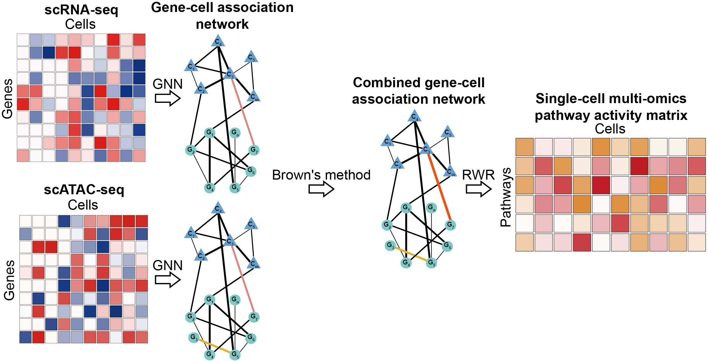

<h1>scapGNN：Graph Neural Network-based Framework for Active Pathway and Gene Module Inference from Single-cell Multi-omics Data</h1>


# Installation

```

1. CRAN
install.packages("scapGNN")

2. GitHub
library(devtools);
install_github("XuejiangGuo/scapGNN")

Notice:
The ConNetGNN() function of scapGNN is implemented based on pytorch, so an appropriate python environment is required:

python >=3.9.7
pytorch >=1.10.0 (CPU)
sklearn >=0.0
scipy >=1.7.3
numpy >=1.19.5

We also provide environment files for conda: /inst/extdata/scapGNN_env.yaml. Users can install it with the command: conda env create -f scapGNN_env.yaml.
```

# Descriptions
scapGNN is a uniform framework based on the graph neural network (GNN) for single-cell active pathway and cell phenotype-associated gene modules analysis. We model a GNN to generate the latent features of the single-cell data, which learns and infers gene-cell associations. It convert the sparse unstable single-cell profiling data into a stable gene-cell association network by aggregating adjacent node information. The genes with dropouts or low expressions were considered by taking into account the association effect with other nodes (**Fig 1**). For single-cell multi-omics data, we use a network fusion method to merge gene-cell association network from different omics. The random walk with restart (RWR) algorithm further measures pathway activity scores and identify cell phenotype-associated gene modules. We use real and simulated single-cell datasets to benchmark the performance of scapGNN, and found that it performed better than the state-of-art methods in cell clustering, identification of active pathway and cell phenotype-associated gene modules (**Fig 2**).


**Fig 1.** An overview of the scapGNN framework. **A** The input is the gene-cell matrix of scRNA-Seq or gene activity matrix generated from scATAC-seq. A graph-based autoencoder, which contains a deep neural network autoencoder and a graph convolutional autoencoder, learns the latent associations between genes and cells. The RWR algorithm quantifies pathway activity and identifies cell phenotype-associated gene modules. **B** The main capabilities of scapGNN include inferring single-cell pathway activity profiles, constructing cell cluster association networks, identifying cell phenotype-associated gene modules under multiple cell phenotypes, and quantifying the importance of genes in the pathway.
</br>



**Fig 2.** The workflow of integrating single-cell multi-omics data by scapGNN. First, GNN model of scapGNN constructs gene-cell association network for gene expression profiles of scRNA-seq data and gene activity matrix of scATAC-seq data, respectively. Second, the Brown's method integrates two gene-cell association networks to combined gene-cell association network. Finally, the RWR algorithm is used to calculate pathway activity scores and identify cell phenotype-associated gene modules with multi-omics information.

# Codes and used
For detailed functions and usage instructions, please refer to https://cran.r-project.org/web/packages/scapGNN/index.html or use help() to see the documentation for each function after installing scapGNN package.

# Reference
The paper is being submitted.
