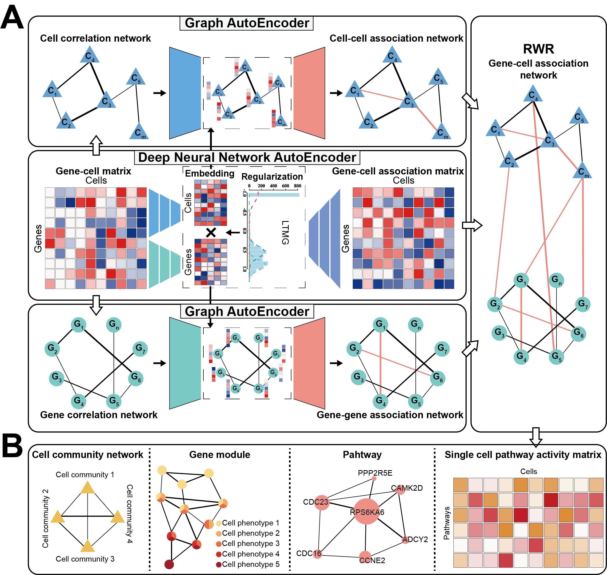

```{r, include = FALSE}
knitr::opts_chunk$set(
  collapse = TRUE,
  comment = "#>"
)
```

```{r setup}
library(scapGNN)
```

# Introduction
With the widespread availability of single-cell sequencing technology, numerous single-cell RNA-seq and ATAC-seq data are collected into public databases. However, the single-cell data have characteristics such as drop-out events and low library sizes. How to leverage these data to parse cellular heterogeneity at the pathway level and identify activated gene modules with multiple cell phenotypes is still a challenge.

Here, we propose `scapGNN`, an accurate, effective, and robust framework to comprehensively parse single-cell data at the pathway level from single-omics data or multi-omics integration data.
The `scapGNN` model takes single-cell gene expression profiles or the gene activity matrix of scATAC-seq as input data. As shown in Figure 1A, the computing architecture consists of three modules: 

1. A depp neural network-based autoencoder, which is used to extract cellular features, gene features, and mine latent associations between genes and cells.

2. A graph convolutional network-based graph autoencoder, which is used to construct cell-cell association network and gene-gene association network.

3. Random walk with restart (RWR), which is used to calculate the activity score of a pathway or gene set in each cell.

For the SNARE-seq dataset, `scapGNN` can integrate gene-cell association networks from scATAC-seq and scRNA-seq into one combined network by the Brown's extension of the Fisher's combined probability test. According to the combined gene-cell association network, pathway activity scores or activated gene modules are supported by single-cell multi-omics (Figure 2). `scapGNN` also designs abundant visualization programs to clearly display the analysis results. Taken together, its capabilities enable `scapGNN` to calculate pathway activity scores in a single cell, assess pathway heterogeneity between cells, identify key active genes in pathway, mine gene modules under multiple cell phenotypes, and provide gene and cell network data (Figure 1B).

```{r echo = F, out.width = "100%"}

```
**Figure 1** Overview of the scapGNN framework.

```{r echo = F, out.width = "100%"}
knitr::include_graphics("../inst/extdata/flow_diagram2.png")
```
**Figure 2** The workflow of integrating scRNA-seq data and scATAC-seq data by scapGNN.

# Data preprocessing
## single-cell RNA-seq data
Single-cell gene expression profiles data needs to pass `Seurat`'s pre-processing workflow. These represent the selection and filtration of cells based on QC metrics, data normalization, and the detection of highly variable features. 

```
library(Seurat)

# Load the PBMC dataset (Case data for seurat)
pbmc.data <- Read10X(data.dir = "../data/pbmc3k/filtered_gene_bc_matrices/hg19/")

# Our recommended data filtering is that only genes expressed as non-zero in more than
# 1% of cells, and cells expressed as non-zero in more than 1% of genes are kept.
pbmc <- CreateSeuratObject(counts = pbmc.data, project = "case",
                                    min.cells = 3, min.features = 200)
                                    
pbmc[["percent.mt"]] <- PercentageFeatureSet(pbmc, pattern = "^MT-")

pbmc <- subset(pbmc, subset = nFeature_RNA > 200 & nFeature_RNA < 2500 & percent.mt < 5)

# Normalizing the data.
pbmc <- NormalizeData(pbmc, normalization.method = "LogNormalize")

# Identification of highly variable features.
pbmc <- FindVariableFeatures(pbmc, selection.method = 'vst', nfeatures = 2000)

# Run Preprocessing() of scapGNN.
Prep_data <- Preprocessing(pbmc,verbose=FALSE)
```

Detailed procedures and descriptions can be found in vignettes of `Seurat` (<https://satijalab.org/seurat/>).

```{r}
# Users can also directly input data in a data frame or matrix format which contains hypervariable genes and is log-transformed.
data("Hv_exp")
Prep_data <- Preprocessing(Hv_exp,verbose=FALSE)
summary(Prep_data)
```

## single-cell ATAC-seq data
First, the `Signac` package is used to quantify the activity of each gene in the genome by assessing the chromatin accessibility associated with each gene, and create a new gene activity matrix derived from the scATAC-seq data. For details, please refer to vignettes of `Signac` (<https://satijalab.org/signac/index.html>).
As with single-cell gene expression profiles, the ensuing gene activity matrix is normalized and detected highly variable features by the `Seurat` package. Finally, the `Preprocessing()` of `scapGNN` further processes the data into the required format.

# Construct gene-cell association network
Using the `Preprocessing()` function results of scRNA-seq or scATAC-seq as input, the `ConNetGNN()` function evaluates whether gene-gene, cell-cell, and gene-cell are associated and levels of strength. Finally, an undirected and weighted gene-cell network is constructed and use for subsequent analysis.

The `ConNetGNN()` function is implemented based on `pytorch`, so an appropriate python environment is required:

- python  >=3.9.7
- pytorch >=1.10.0 (CPU)
- sklearn >=0.0
- scipy   >=1.7.3
- numpy   >=1.19.5

We also provide environment files for conda: `/inst/extdata/scapGNN_env.yaml`. Users can install it with the command: `conda env create -f scapGNN_env.yaml`.

```
library(coop)
library(reticulate)
library(parallel)
# Data preprocessing
data("Hv_exp")
Prep_data <- Preprocessing(Hv_exp)

# Run ConNetGNN()
ConNetGNN_data <- ConNetGNN(Prep_data,python.path="../miniconda3/envs/scapGNN_env/python.exe")

```

```{r}
# View the content of the ConNetGNN() results.
data(ConNetGNN_data)
summary(ConNetGNN_data)
```

For the SNARE-seq dataset, the `ConNetGNN()` results of scRNA-seq and scATAC-seq can be integrated into a combined gene-cell association network via `InteNet()`.

```
library(ActivePathways)
library(parallel)
data(RNA_net)
data(ATAC_net)
RNA_ATAC_IntNet<-InteNet(RNA_net,ATAC_net,parallel.cores=1)

```

# Infer pathway activity score matrix at the single-cell level
For the gene-cell association network constructed by `ConNetGNN()`, the `scPathway()` function uses RWR algorithm to calculate the pathway activity score of each cell.

```
library(parallel)
library(utils)
# Load the result of the ConNetGNN function.
data(ConNetGNN_data)
# We recommend the use of a compiler.
# The compiler package can be used to speed up the operation.
# library(compiler)
# scPathway<- cmpfun(scPathway) 
scPathway_data<-scPathway(ConNetGNN_data,gmt.path=system.file("extdata", "KEGG_human.gmt", package = "scapGNN"),parallel.cores=1)
```

The result `scPathway_data` of `scPathway()` is a matrix of pathway activity scores, with rows as pathways and columns as cells.

```{r,fig.width = 15,fig.height = 7}
data(scPathway_data)
scPathway_data[1:3,1:3]

```

```
library(pheatmap)
pheatmap(scPathway_data)
```

```{r echo = F, out.width = "100%"}

```


Use the `plotGANetwork()` function to plot the gene network of pathways in the specified cell phenotype.

```{r,fig.width = 7,fig.height = 7}
library(igraph)

# Load data.
data(ConNetGNN_data)
data("Hv_exp")

# Construct cell set.
index<-grep("0h",colnames(Hv_exp))
cellset<-colnames(Hv_exp)[index]

# Construct gene set.
pathways<-load_path_data(system.file("extdata", "KEGG_human.gmt", package = "scapGNN"))
geneset<-pathways[[which(names(pathways)=="Tight junction [PATH:hsa04530]")]]

plotGANetwork(ConNetGNN_data,cellset,geneset,vertex.label.dist=1.5,main = "Tight junction [PATH:hsa04530]")
```

The `plotGANetwork()` function can construct and display a cell community network.

```{r,fig.width = 7,fig.height = 7}
require(igraph)
require(graphics)

data(ConNetGNN_data)

# Construct the cell phenotype vector.
cell_id<-colnames(ConNetGNN_data[["cell_network"]])
temp<-unlist(strsplit(cell_id,"_"))
cell_phen<-temp[seq(2,length(temp)-1,by=3)]
names(cell_id)<-cell_phen
head(cell_id)
plotCCNetwork(ConNetGNN_data,cell_id,edge.width=10)
```

# Identification of activated gene modules

The `cpGModule()` can identify cell phenotype activated gene module.

```{r}
require(parallel)
require(stats)

# Load the result of the ConNetGNN function.
data(ConNetGNN_data)
data(Hv_exp)

# Construct the cell set corresponding to 0h.
index<-grep("0h",colnames(Hv_exp))
cellset<-colnames(Hv_exp)[index]
H9_0h_cpGM_data<-cpGModule(ConNetGNN_data,cellset,parallel.cores=1)
summary(H9_0h_cpGM_data)
```

Use the `plotGANetwork()` function to plot the gene network of module.

```{r,fig.width = 7,fig.height = 7}
library(igraph)

# Load data.
data(ConNetGNN_data)
data("Hv_exp")
data("H9_0h_cpGM_data")

# Construct cell set.
index<-grep("0h",colnames(Hv_exp))
cellset<-colnames(Hv_exp)[index]

# Construct gene set.
geneset<-H9_0h_cpGM_data$Genes

plotGANetwork(ConNetGNN_data,cellset,geneset,vertex.label.dist=1.5,main = "Gene network of 0h cells activated gene module")
```

For multiple cellular phenotypes (e.g. classification, time stage, etc.), `cpGModule()` identifies the activated gene modules individually. The `plotMulPhenGM()` function then quantifies the activation strength of genes in different cell phenotypes and displays gene networks under multiple cell phenotypes.

```{r,fig.width = 7,fig.height = 7}
require(igraph)
require(grDevices)
# Load the result of the ConNetGNN function.
data(ConNetGNN_data)
# Obtain cpGModule results for each cell phenotype.
data(H9_0h_cpGM_data)
data(H9_24h_cpGM_data)
data(H9_36h_cpGM_data)
data.list<-list(H9_0h=H9_0h_cpGM_data,H9_24h=H9_24h_cpGM_data,H9_36h=H9_36h_cpGM_data)
plotMulPhenGM(data.list,ConNetGNN_data,margin=-0.05)
```


# Data analysis and visualization combined with Seurat package

The single-cell pathway activity matrix can be docked with the `Seurat` package to perform non-linear dimensional reduction, identify differentially active pathways, draw heat map, violin plot, and more.

```
library(dplyr)
library(Seurat)
library(patchwork)

data(scPathway_data)
data <- CreateSeuratObject(counts = scPathway_data, project = "Pathway")
all.genes <- rownames(data)
data <- ScaleData(data, features = all.genes,verbose = FALSE)
data <- RunPCA(data, features =all.genes,verbose = FALSE)
data <- FindNeighbors(data, verbose = FALSE)
data <- FindClusters(data, resolution = 0.5,verbose = FALSE)
data <- RunUMAP(data,dims = 1:15, verbose = FALSE)

cell_phen<-unlist(strsplit(colnames(scPathway_data),"_"))
cell_phen<-cell_phen[seq(2,length(cell_phen)-1,by=3)]

data@active.ident<-as.factor(cell_phen)

# Visualize non-linear dimensional reduction
DimPlot(data, reduction = "umap")

# Identify differentially active pathways
diff.pathways <- FindAllMarkers(data,verbose = FALSE)

# violin plot
VlnPlot(data, features = "MAPK signaling pathway [PATH:hsa04010]")

# heat map
DoHeatmap(data, features = row.names(scPathway_data))
```

